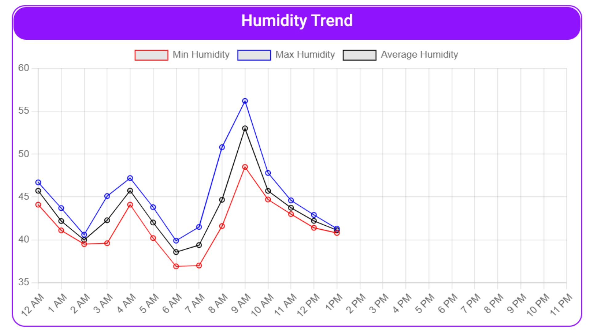

# Intern Hiring Challenge 2022

Welcome to our Hiring Challenge-2022. 
Through this challenge we are trying to select interns who have passion to work in FrontEnd and IOT. 

Best of luck everyone!!

Use issues to ask any queries

Only make use you use of the data given rather than using any other dataset. 

## Evaluation Criteria

Connect Template with MongoDB - 10 marks

Build charts using the dataset given - 50 marks

Speed & Optimization of Charts - 30

Any Out of the Box Idea Implementation - 10 marks

## Process

01) You can select any dashboard template from [here](https://dev.to/davidepacilio/30-free-react-dashboard-templates-and-themes-49g4) to solve this assesment. 

02) Download the Mongo Dataset in data folder 

03) Connect Template with MongoDB

04) Use this Dataset for building 2 Charts
The temp-hum-entries file contain entries of 6 zones with their Temperature & Humidity Value.

a) Build a Temperature vs Time(Per Hour) Charts of a date.

b) Build a Humidity vs Time(Per Hour) Charts of a date.

Eg- Below is the Humidity vs Time chart for Zone 1 of 20 Sept 2022. 

## Submission

01) You have 7 days to complete this challenge

02) Create Git Repository and submit it to info@igscs.in before deadline
